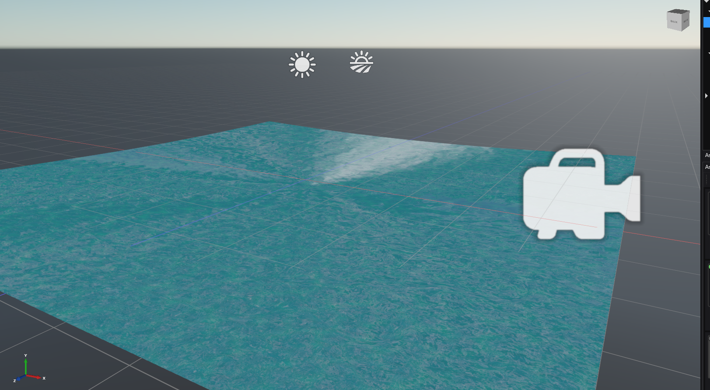
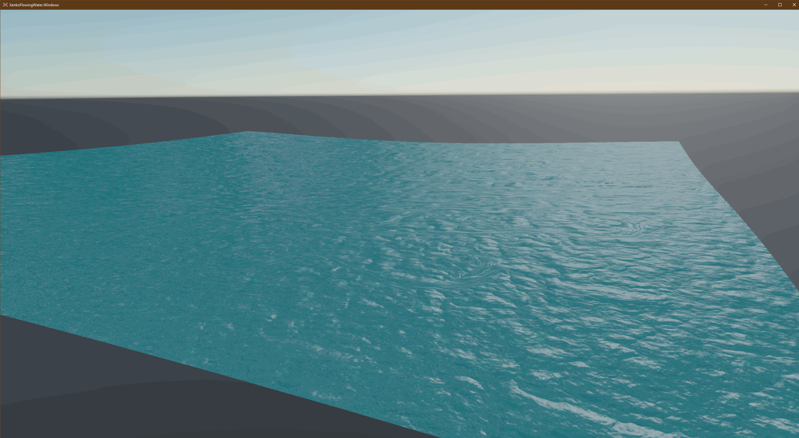

# XenkoFlowingWater

This sample shows a simple way to general moving water by using a scrolling flow map along with scrolling and blended normal maps.

## Screenshots

### In-Editor

### In-Game

### Options

* Render Group - The [WaterFlowMapRenderFeature](XenkoFlowingWater/WaterFlowMapRenderFeature.cs) has a parameter that is setup in the GraphicsComposer for which render group(s) to include. Make sure this property is set to one that the WaterFlowMapRenderFeature is targeting.
* Size - How large the piece of water should be, in Xenko units.
* Texture Scale - Scales all textures on the water surface. Typically this would be the same for the Size property, unless your textures look better in a ratio better than 1:1. Play with this setting as you play with the textures.
* Tesselation X - how many quads the water surface is divided into along the X axis.
* Tesselation Y - how many quads the water surface is divided into along the Y axis. Note: Xenko uses Y-Up coordinates so this is actually the Z-axis in game.
* Sun - A directional light to reflect on the water surface. NOTE: This is an unfinished feature. A hard-coded light source is reflected right now. A future update may implement this.
* Camera Slot - The camera slot to use for renderig. The camera assigned to this slot is used to determine the viewing angle for reflections.
* Noise Map Texture - This is a texture that is sampled to give a semi-random look to the textures at given points.
* Sky Texture - The sky to reflect off of the water. NOTE: This texture is by far the most important texture for determining water surface color.
* Water Floor Texture - A texture to use for rendering visually "under" the water. This texture is optional and may not make sense for water that is intended to appear deep.
* Flow Map Texture - This texture is sampled and all other textures are sampled with an offset from that sampling.
* Normal Map Texture1 - This texture is used to create surface reflection alterations. This is sampled and blended with Normal Map Texture 2.
* Normal Map Texture2 - This texture is used to create surface reflection alterations. This is sampled and blended with Normal Map Texture 1.
* Diffuse Texture1 - This texture adds a visual pattern to the surface of the water, such as foam. This is sampled and blended with Diffuse Texture2.
* Diffuse Texture2 - This texture adds a visual pattern to the surface of the water, such as foam. This is sampled and blended with Diffuse Texture1.
* Water Transparency - This control how much transparency the water surface has, if any.
* Displacement Speed - If you want the water to have a basic wave-like displacement set this value > 0.0f. This value effects how fast the displacement will change. Values over 0.25f will start to look unrealistic.
* Displacement Amplitude - If you want the water to have a basic wave-like displacement set this value > 0.0f. This value effects how high the maximum water displacement is. Values over 0.5f will start to look unrealistic.
* Use Caustics - This will add a very simple caustic effect to the water. This will also drastically change the color of the water surface. A more robust implementation of causics could be created to give more control.
